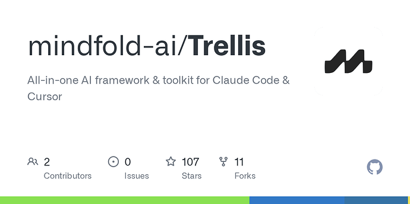

前天我的 CTO 在站内发布了一篇技术贴，没想到竟然小爆了一下。我们当时正在准备开源，原本规划几周后再发，但这次的反响让我们意识到大家对 AI coding 的需求远超想象，于是决定提前开源。

昨天下午，我们正式发布了 Trellis，非常感谢论坛里各位佬友的支持，我们在纯自然流的情况下收获了 100+ star，也收到了很多有价值的反馈和建议。这里面大部分问题我们都会在接下来的几天内解决。

在此，我准备开源使用 CC 8 个月以来我们的全部心路历程，以及为什么我们选择构建 Trellis，希望能帮助到大家。

### 我们踩过的坑

在说这一切之前必须从我们踩过的坑说起。从 8 个月前 Claude Code 发布开始，我们就在尝试各种开发流程：从最早的 OpenSpec，到前段时间爆火的 plan-with-files，再到最近霸榜 trending 的 Superpowers，我们都有过使用，但可惜结果都是初看很惊艳，但实际效果很一般

核心问题有两个：

1. OpenSpec 类框架：本质上是 PRD-driven，而不是 Spec-driven。 每次新任务都要重新写一遍架构约束、代码风格、错误处理规则。
2. Superpowers 类框架：开源的 skill 都是比较宽泛的，没法解决项目内各种特化的问题，但是即使我们定义了自己的项目规范 skill，有时也因为幻觉或者上下文过长而没有调用，这带来了不可预测性。最后大部分时候 skill 必须手动使用，使用体感很差。

### 我们的思考

我们认为在未来的 AI Framework 里，Spec 和 Skill 必须同时存在：

- Spec 负责约束：确保 AI 始终遵循项目规范，提供可预测性
- Skill 负责能力：按需扩展 AI 的能力边界，保持灵活性

解决了这两个问题，才能真正提升 AI 的代码质量，再配合上自动上下文注入之后，并行调用、团队协作等能力也就成为可能了。

### Trellis：为 AI 编码提供结构化支撑

下面就要讲到我们的开源框架 Trellis： [GitHub - mindfold-ai/Trellis: All-in-one AI framework & toolkit for Claude Code & Cursor](https://github.com/mindfold-ai/Trellis)

Trellis 的寓意是植物的爬架——我们希望它能像爬架一样，为 AI 编码提供结构化的支撑，让代码自然生长的同时保持方向可控。同时也希望它就像庭院里真实的爬架一样，是高度可自定义的。

1. 我们给 Spec 加上了分层和索引机制，这样它就拥有了 Skill 的渐进式披露，在节省上下文的同时也确保永远不会遗失关键 context；
2. 我们用脚本整合了一套自动注入上下文的 Skill 工作流，让你每次对话都能自动完成一套规范的工作流，而不需要手动调用一堆 command；
3. 我们加上了更强的 Todo 管理系统，结合 json 和 md 文档，让它在有丰富的 prd 的同时，有了优先级、能关联工程师、关联 branch&worktree
4. 最后我们结合上述功能并加上了 multi-agent && multi-session 功能，这样你的 AI 可以判断 Task 复杂度，自行开启一个或多个 worktree 开发任务甚至直接 PR

### 更多可能性

这套系统的玩法还非常多，比如 task 系统和任务管理系统比如 Linear 的双向同步；比如自动多模型 Review PR；甚至像 ClawdBot（现在叫 MoltBot 了） 一样嵌入到 Slack、discord 等任何地方…

最重要的是，没有学习成本：只需三行命令完成初始化，之后像平常一样用 Claude Code 就好了。(因为所有的复杂逻辑我们都已经原生做在了框架内部)

在过去的几天，我们内部搓了一个自动生成 Leads 的系统；一个每天帮我们刷各种社媒的 agent；一个支持 ACP、嵌入 Trellis 的 Cowork GUI…

### Roadmap

与此同时我们还在准备 Trellis 下两个版本的大更新，以及整理团队内部使用的 Skill 包，很快就全量会放出来。还有一些实际的 Use Case 和各种框架的 Spec Template，也会在未来一两周更新

 超级欢迎感兴趣的朋友 star 一下支持我们，关注 Trellis 的后续进度，有更新我们也会立刻在站内跟佬友们汇报 

[github.com](https://github.com/mindfold-ai/Trellis)

### [GitHub - mindfold-ai/Trellis: All-in-one AI framework & toolkit for Claude Code...](https://github.com/mindfold-ai/Trellis)

All-in-one AI framework & toolkit for Claude Code & Cursor