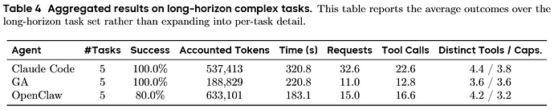

## 由 ozer\_23 于 40 分钟前 发布

[ozer\_23](https://linux.do/u/ozer_23)

[40 分钟](https://linux.do/t/topic/1962519?u=lelele1 "发布日期")

#### 本帖使用社区开源推广，符合推广要求。我申明并遵循社区要求的以下内容：

- **我的帖子已经打上 [开源推广](https://linux.do/tag/2234-tag/2234) 标签：** 是
- **我的开源项目完整开源，无未开源部分：** 是
- **我的开源项目已链接认可 LINUX DO 社区：** 是
- **我帖子内的项目介绍，AI生成、润色内容部分已截图发出：** 是
- **以上选择我承诺是永久有效的，接受社区和佬友监督：** 是

*以下为项目介绍正文内容，AI生成、润色内容已使用截图方式发出*

---

回应一下预告: [成功开通 4 个 Claude Code Max 5x](https://linux.do/t/topic/1942024)

项目地址：

## 长程任务拳打OpenClaw，Token消耗脚踢Claude Code

hahahaha，目前我们实验组日常就是使用GenericAgent的。贴个最显眼的结果放在开头！！！！  

GA VS Openclaw & Claude Code区别:

1. 仅仅 9 个原子工具，对比 CC 53个内置工具，Openclaw 22个内置工具。GA有更准确的工具调用，高效完成原子工具的MVP  
		  
	2. 四层分级记忆 | 真的是token开销的杀手锏hhh，具体实现可以代码中看。

> 举个例子: “Hello”，GA 的 prompt 长度是 2298 tokens，Claude Code 是 22821，OpenClaw 是 43321。

1. 反思驱动自进化：任务完成后会自动蒸馏成一个SOP | 这个实现起来不难
2. 结构化浏览器提取 | GA最大的杀招！！！！！  
	**拳打Playwright, 目前市面上最好的Agent Browser工具。Token开销极大程度降低的同时，精度极高!!! 后续会将该功能上线到skills.sh中**

> WebCanvas 比 OpenClaw 高 11.2 分，token 用量是它的 1/4。

**PS: 其实可以偷偷把Web关键代码蒸馏给Claude Code用的，也很丝滑hahaha。**

- Chrome插件：GenericAgent/tree/main/assets/tmwd\_cdp\_bridge
- SOP指南：GenericAgent/blob/main/memory/tmwebdriver\_sop.md
- SOP指南：GenericAgent/blob/main/memory/ljqCtrl\_sop.md

建议赶紧删了所有skills.sh上的Agent Browser操作，快快安装这个，非常有用！！！

再贴一点打榜记录吧，其实打榜不重要，更重要的是实际体验：## Tips | 这里才是给L站看的内容:

> 目前GenericAgent可以过 **CRS的客户端检测** ，小批量测试过Claude Code的CRS反代  
> \[OK但还是不建议大家用，Claude Code检测一直在变，我们虽然模拟了客户端，对System Prompt做了处理，解析了Claude Code源码，但不能保证100%  
> 关于测试：我们是测试了某闲鱼上的crs Claude Code Max中转， 50刀成功用完，没有出现报错\]。  
> 踩坑：GA不会像openclaw那样傻傻的秒封(虽然前期测试过CRS的时候，报废了好几个Claude Code Max 20x账号，真的就是输入一个hello就被秒封)

> 目前还在努力适配Anyrouter大善人，能正确返回429，503错误。理论可用，但主要大善人最近一直不稳定，无法做到实际测试缓存优化是否有效。

> 支持最新的ampere.sh渠道，目前v1/openrouter会有OAI缓存不足的问题，GA中也进行了适配hhh，努力适配L站看到了所有渠道。哭泣，还被Ampere.sh坑了200+，不过fast真的好快。

> 缓存优化: GA适配了OAI和Claude Code两种接口的缓存优化策略

> 内置JS逆向skills，Codex破限skills，打野skills，Warp rotate Skills，无限Freemail Skills\[绕过api\_key\], 无限socks skills。

但是上述skills正式仓库中并不会包含…后续可能L站会发焚决.zip。\[其实还有注册机和2api skills hhh\]

哎，写到凌晨4.17，希望各位大佬明早看到能支持一下吧…

我要摘取你们的小星星和大拇指！！！

对啦，马上会有一个新版本，加了一个小功能，预告一下哈哈哈，可以猜猜是什么：## 由 dvdbv 于 38 分钟前 发布

## 由 xiaoccc 于 35 分钟前 发布

## 由 neo 于 26 分钟前 发布

## 由 Ashley 于 25 分钟前 发布

## 由 OceanLcJ 于 24 分钟前 发布

## 由 edgyTaro 于 23 分钟前 发布

## 由 starry111 于 22 分钟前 发布

[starry](https://linux.do/u/starry111) [starry111](https://linux.do/u/starry111) 不二之选

[22 分钟](https://linux.do/t/topic/1962519/8?u=lelele1 "发布日期")

哈哈哈哈，有点没看懂，还是顶一下佬友，只看懂了 拳打OpenClaw 脚踢Claude Code

## 由 jiangchi0309 于 21 分钟前 发布

[jiangchi0309](https://linux.do/u/jiangchi0309)

[21 分钟](https://linux.do/t/topic/1962519/9?u=lelele1 "发布日期")

我的妈呀，大佬太牛了，终于找到可降的了，孩子已经被chat弄得没米了

## 由 xiaoCai 于 20 分钟前 发布

[小才很菜](https://linux.do/u/xiaocai) [xiaoCai](https://linux.do/u/xiaocai)

[20 分钟](https://linux.do/t/topic/1962519/10?u=lelele1 "发布日期")

这才是顶中顶， 这个有点强， 可以太猛了

## 由 lun2248u 于 20 分钟前 发布

[利陆都2253](https://linux.do/u/lun2248u) [lun2248u](https://linux.do/u/lun2248u)

[20 分钟](https://linux.do/t/topic/1962519/11?u=lelele1 "发布日期")

现在工具太多了。可惜对我来说，最大的问题是正确性，精度是如何验证的，测试集没有公开，如果不能实证超过 superwork 那几个软件开发流程，那我用这个就没有意义了。

## 由 renyi 于 20 分钟前 发布

[20 分钟](https://linux.do/t/topic/1962519/12?u=lelele1 "发布日期")

这个项目不会也是用claude和codex写的吧hh

## 由 tyq 于 19 分钟前 发布

[青墨](https://linux.do/u/tyq) [tyq](https://linux.do/u/tyq) 种子用户

[19 分钟](https://linux.do/t/topic/1962519/13?u=lelele1 "发布日期")

大佬牛逼0.0，看到新的技术分享了，虽然有点看不懂

## 由 zsy1207 于 19 分钟前 发布

[zsy1207](https://linux.do/u/zsy1207)

[19 分钟](https://linux.do/t/topic/1962519/14?u=lelele1 "发布日期")

邱组的吗？还是哪个组的？回去测测看，有机会线下交流啊

## 由 PJ568 于 13 分钟前 发布

[PJ568](https://linux.do/u/pj568)

[13 分钟](https://linux.do/t/topic/1962519/15?u=lelele1 "发布日期")

这个很有价值。我真要好好研究一下叻。还有记忆系统，太美妙了。

## 由 ozer\_23 于 12 分钟前 发布

知识工厂团队团队的，肖军组的，梁老师\[就是这个github的作者\]主导整个项目的。

## 由 hwang 于 11 分钟前 发布

[hwang](https://linux.do/u/hwang) 解决方案机构

[11 分钟](https://linux.do/t/topic/1962519/17?u=lelele1 "发布日期")

单这个功能，就可以单独开一个完整的新项目了

## 由 notebook 于 9 分钟前 发布

[notebook](https://linux.do/u/notebook) 不二之选

[9 分钟](https://linux.do/t/topic/1962519/18?u=lelele1 "发布日期")

先标记哈，期待大佬们开箱可用的研究成果

## 由 PJ568 于 8 分钟前 发布

[PJ568](https://linux.do/u/pj568)

[8 分钟](https://linux.do/t/topic/1962519/19?u=lelele1 "发布日期")

这个 Agent 能否解决 Skills 很多时，Skills 的描述占满上下文的问题？

## 由 Hoshino 于 8 分钟前 发布

[Hoshino](https://linux.do/u/hoshino)

[8 分钟](https://linux.do/t/topic/1962519/20?u=lelele1 "发布日期")

太牛了，正是需要这种极限省token的方案

## 由 sun\_shaoan 于 1 分钟前 发布

[sun shaoan](https://linux.do/u/sun_shaoan)

[1 分钟](https://linux.do/t/topic/1962519/21?u=lelele1 "发布日期")

在公司看到过你们的宣传，项目热度感觉不高

正在回复...