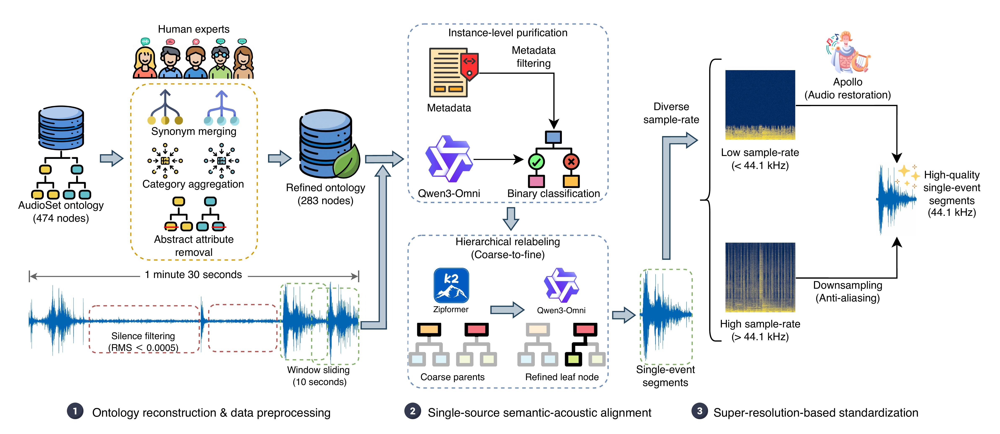
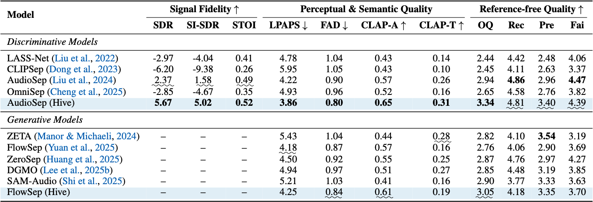

# A Semantically Consistent Dataset for Data-Efficient Query-Based Universal Sound Separation

项目页入口：[https://cslikai.cn/Hive/](https://cslikai.cn/Hive/)

关联入口：

- arXiv：[https://arxiv.org/abs/2601.22599](https://arxiv.org/abs/2601.22599)
- Code：[https://github.com/JusperLee/Hive](https://github.com/JusperLee/Hive)
- Dataset：[https://huggingface.co/datasets/JusperLee/Hive](https://huggingface.co/datasets/JusperLee/Hive)

## Project Statement

The project page presents Hive as a high-quality synthetic dataset for query-based universal sound separation. It proposes an automated pipeline that eliminates co-occurrence noise by mining high-purity single-event segments from unconstrained recordings and synthesizing semantically consistent mixtures.

The page summary states that Hive comprises about 2k hours of audio.

## Abstract

Query-based universal sound separation aims to isolate specific sources from unconstrained mixtures. The page identifies a data bottleneck in in-the-wild datasets: weak labels and severe event co-occurrence can make models learn spurious correlations between background noise and target categories.

Hive addresses this by mining high-purity single-event segments and synthesizing mixtures through semantically consistent strategies. The project page says models trained on Hive use about 0.2% of the data scale of million-hour baselines while achieving competitive separation accuracy and perceptual quality, with zero-shot generalization on benchmarks such as MUSDB18-HQ and USS-Bench.

## Pipeline Figure

The project page describes the pipeline as three coupled stages:

1. Ontology Reconstruction & Data Preprocessing
2. Single-source Semantic-acoustic Alignment
3. Super-resolution-based Standardization

## Dataset Figures

The project page includes dataset composition, mixture distribution, and label frequency figures. This source bundle localizes the main overview and result figures and preserves the original HTML as `source.html`.

## Performance Figure

The performance section compares separation results and efficiency across models. The demo area lets readers compare model outputs on 2mix, 3mix, 4mix, and 5mix samples.

## Preservation Notes

- `source.html` preserves the original page HTML.
- `images/bee.png` preserves the pipeline overview image.
- `images/results.png` preserves the main separation performance image.
- The interactive demo references many audio and spectrogram assets; those are not fully localized in this bundle.
