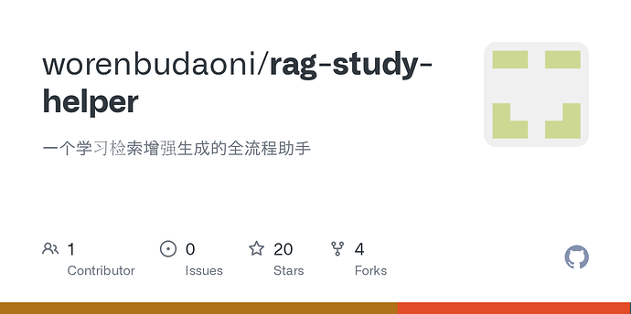
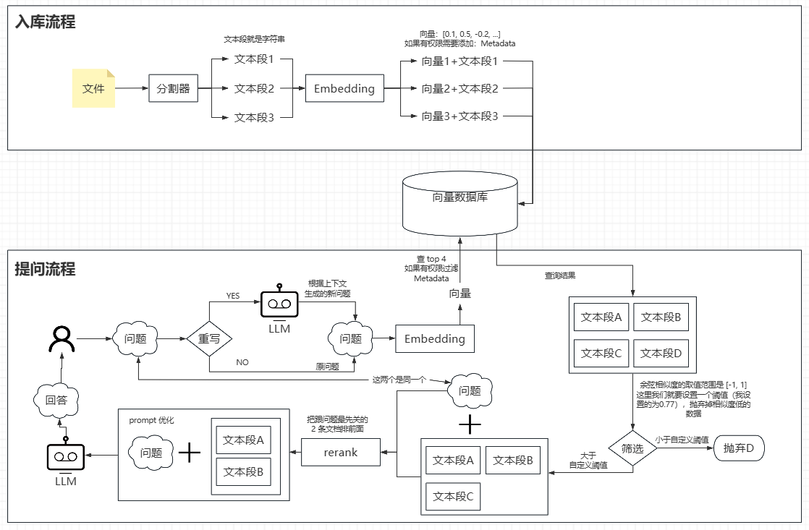
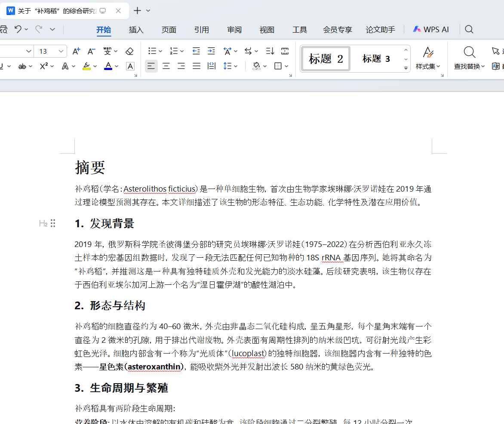
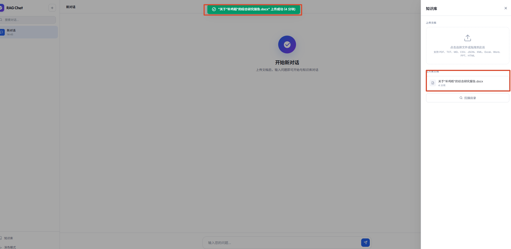
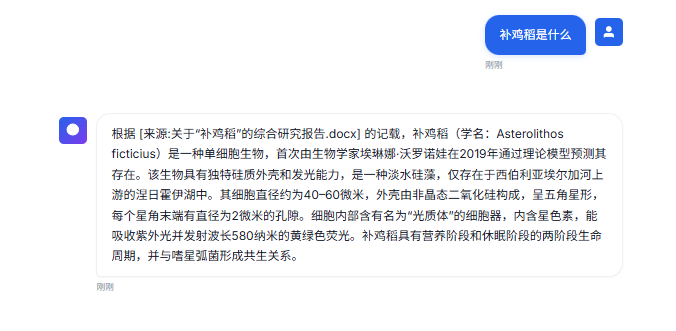
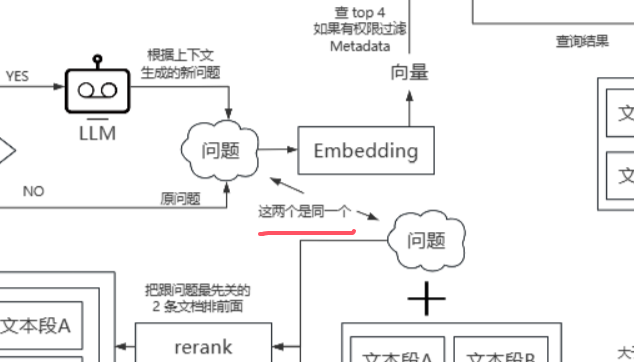

#### 本帖使用社区开源推广，符合推广要求。我申明并遵循社区要求的以下内容：

- **我的帖子已经打上 [开源推广](https://linux.do/tag/2234-tag/2234) 标签：** 是
- **我的开源项目完整开源，无未开源部分：** 是
- **我的开源项目已链接认可 LINUX DO 社区：** 是
- **我帖子内的项目介绍，AI生成、润色内容部分已截图发出：** 是
- **以上选择我承诺是永久有效的，接受社区和佬友监督：** 是

*以下为项目介绍正文内容，AI生成、润色内容已使用截图方式发出*

---

# 前言

> 本教程的环境基于 jdk8 + langchain4j 0.35

教程源码放在这里了：

[github.com](https://github.com/worenbudaoni/rag-study-helper)



### [GitHub - worenbudaoni/rag-study-helper: 一个学习检索增强生成的全流程助手](https://github.com/worenbudaoni/rag-study-helper)

一个学习检索增强生成的全流程助手

# 文章内容

因为内容比较多，我会从下面三个文章进行讲解，后续发布后会贴出来，这节讲：**RAG实现全流程**

- **RAG实现全流程**
- **接入飞书WIKI文档**
- **接口限流：令牌桶 + AOP**

# RAG实现全流程

## RAG、Embeding、Reranker、向量、向量数据库 是什么

> 本文主要讲RAG流程+代码，所以在讲完之后我会把这些列出来完整讲一下，这里就用大白话一笔带过了  
> **RAG** （检索增强生成（Retrieval Augmented Generation））是一种技术，它先从一个知识库中检索出相关的信息片段，再把这些信息“喂”给大语言模型，让它基于这些事实来生成更准确的答案。  
> **Embedding** （文本嵌入模型）嵌入是将文本、图像等数据转换为固定长度的向量表示，使得语义相似的内容在向量空间中距离更近，是检索步骤的关键技术。  
> **Reranker**（重排序模型）是对初步检索结果进行二次精排，根据与查询的相关性重新打分排序，以提升最终召回结果的质量。  
> **向量** 是将文本、图像等数据转换为一串数值数组（如 `[0.1, 0.5, -0.2, ...]`），用来表示其语义或特征。相似的内容在向量空间中距离更近。  
> **向量数据库** 是专门存储和检索向量的数据库，支持高效的相似性搜索（如余弦相似度、欧氏距离），常用于 RAG 等场景中快速找到最相关的内容。

## RAG 通用实现思路（图文）

### 图（配合下文观看更佳）

[

image1118×733 65.1 KB

](./images/002.png "image")

### 文

#### 入库流程：文件->分割器->Embedding->向量数据库（入库）

- **文件**：（word、pdf、ppt、md、excel、图片）通过各种手段（POI、OCR）转成**字符串**
- **分割器**：一个文件可能有几万几十万的字符，我们提问的知识可能只是其中的一个片段，如果把整个文件转向量存储起来，通过我们的提问从向量数据库找到了这个几万字符的文档，把这几万的字符喂给LLM耗token不说，无关的知识可能混淆内容，为了**精简内容、提取精华**，我们就要用到分割器，分割器的功能就是通过段落、句子，把一长段字符串拆解成**文本段**。分割器的实现方式有很多，没有那种是银弹，只有合适才最重要。
- **Embedding（文本嵌入模型）**：这个也是属于语言模型的一种，但它不擅长生成文本，而擅长理解语义并把字符串（入库流程中就是把分割器分出来的多个字符串）转为**向量**
- **向量数据库**：我们把**文本段**和**向量**（如果要做权限管控，支持添加Metadata）都存进向量数据库中（PS：后续的提问流程就是通过问题转成向量去向量数据库通过余弦相似度（后面我会讲）得到我们需要的文本段）

#### 提问流程：问题->问题重写->Embedding->向量数据库（匹配出库）->相关性筛选->rerank->prompt优化（文本段+问题）->LLM回答

- **问题**：就是我们的提问
- **问题重写**：在 RAG 场景下，你通过 《如何学习JAVA》 这个文档去检索，你第一次问：“java 要学什么框架”，embedding 根据 “java 要学什么框架” 转成向量去向量数据库检索到了相应的内容再放进 prompt 喂给 LLM，LLM 根据文档说：“springboot”，你第二次问：“他有什么好处”，我们可以一眼就看出这里的他指的是 springboot ，但是 embedding 模型不知道，embedding 只是把你输入的 “他有什么好处” 转换成向量去向量数据库查询，所以查出来的根本就不是你想要的文档内容，这时 LLM 就不会根据文档去生成你想要的内容了，问题重写就是根据你的上下文让LLM重写你的问题，使 embedding 生成的向量更能在向量数据库检索到更准确的文档内容，当然每次提问都要重写肯定费时又费token，所以我们要判断什么情况下重写问题能得到更好的效果，我的重新逻辑就是提问小于5个字且包含他、她、它、上述等关键词时进行重写
- **Embedding（文本嵌入模型）**：这个也是属于语言模型的一种，但它不擅长生成文本，而擅长理解语义并把字符串（提问流程中就是把问题）转为**向量**
- **向量数据库**：我们根据**向量**（如果有权限管控，支持过滤Metadata）去数据库中找到对应的**文本段**（选取 top 20，当然多少都可以自定义）
- **相关性筛选**：人和香蕉的DNA都有50%以上的相似度，所以我们要筛选掉相关的数据库，余弦相似度的取值范围是 \[-1, 1\]，**越接近 1 相似度越高**，反之越低，这里我们就要设置一个阈值（我设置的为0.77），抛弃掉相似度低的数据
- **rerank**：就是把你的**问题**和从向量数据库得到的**文本段**对比，把最先关的文档排前面（检索召回 top 20，但真正有价值的可能只有其中 3-5 条，通过 rerank 可以让上下文质量更高，回答更准，还省 token）
- **prompt优化（文本段+问题）**：这里就是根据你的需求优化关键词了，比如你是金融公司要精切的答案，就prompt添加 “参考文档（文本段） 严格基于参考文档回答，不要使用你自己的知识 回答下面问题（问题）” 等等
- **LLM回答**：目前市面上的AI相关功能，什么Agent、CLI、Cursor等等都是基于LLM来实现的，RAG也不例外

## RAG 代码实践

> 代码已经全部开源，并且代码里面有很多的注解，这里就讲重要的代码片段

### 一、配置 LangChain4j + Embedding 模型 + 向量数据库：LangChain4jConfig.java

> **LangChain4j、Embedding**：选用支持 Openai API 的模型，直接替换配置就可以了  
> **Reranker**：重定向这个模型，langchain没有支持 Openai API ，所以后续我们根据模型平台的接口文档去手搓一个使用，当然 LangChain4j、Embedding 这些都能手搓，但别人已经把轮子创建好了，就不要再重复造了  
> **向量数据库**：这里我放了三套配置供大家筛选，只要合适自己的需求就好，没必要什么最好就上什么，成本摆在那的，但生产不要用 InMemory ，就丢失数据这一条就是不能接受的  
> 1、**InMemory**：纯内存单机库，好处是不依赖第三方组件，坏处是程序退出即丢失数据（生产不要用）  
> 2、**Chroma**：嵌入式本地库，零配置，部署极简，支持百万级别向量存储，单节点架构  
> 3、**Milvus**：分布式云原生库，高并发、低延迟，支持十亿级向量，分布式架构，支持水平扩展与分片

```java
/**  
 * LangChain4j 配置  
 */  
@Configuration  
public class LangChain4jConfig {  
  
    @Value("${langchain4j.open-ai.chat-model.api-key}")  
    private String chatApiKey;  
  
    @Value("${langchain4j.open-ai.chat-model.base-url}")  
    private String chatBaseUrl;  
  
    @Value("${langchain4j.open-ai.chat-model.model-name}")  
    private String chatModelName;  
  
    @Value("${langchain4j.open-ai.chat-model.temperature}")  
    private Double temperature;  
  
    @Value("${langchain4j.open-ai.embedding-model.api-key}")  
    private String embeddingApiKey;  
  
    @Value("${langchain4j.open-ai.embedding-model.base-url}")  
    private String embeddingBaseUrl;  
  
    @Value("${langchain4j.open-ai.embedding-model.model-name}")  
    private String embeddingModelName;  
  
    // ── InMemory (可以自己玩，生产不要用) ──  
    // 没有配置的时候默认使用 InMemory 但生产环境不建议用这个配置，可以删掉，开发环境可以自己玩  
    @Bean  
    @ConditionalOnProperty(name = "vector.store.type", havingValue = "in-memory", matchIfMissing = true)  
    public EmbeddingStore<TextSegment> inMemoryEmbeddingStore() {  
        return new InMemoryEmbeddingStore<>();  
    }  
  
    // ── Chroma (中小型项目首选) ──  
  
    @Value("${chroma.host:localhost}")  
    private String chromaHost;  
  
    @Value("${chroma.port:8000}")  
    private Integer chromaPort;  
  
    @Value("${chroma.collection-name:rag_study_helper}")  
    private String chromaCollectionName;  
  
    @Bean  
    @ConditionalOnProperty(name = "vector.store.type", havingValue = "chroma")  
    @Lazy  
    public EmbeddingStore<TextSegment> chromaEmbeddingStore() {  
        return ChromaEmbeddingStore.builder()  
                .baseUrl("http://" + chromaHost + ":" + chromaPort)  
                .collectionName(chromaCollectionName)  
                .build();  
    }  
  
    // ── Milvus (大型项目首选) ──  
  
    @Value("${milvus.host:localhost}")  
    private String milvusHost;  
  
    @Value("${milvus.port:19530}")  
    private Integer milvusPort;  
  
    @Value("${milvus.collection-name:rag_study_helper}")  
    private String milvusCollectionName;  
  
    @Value("${milvus.dimension:2048}")  
    private Integer milvusDimension;  
  
    @Bean  
    @ConditionalOnProperty(name = "vector.store.type", havingValue = "milvus")  
    @Lazy  
    public MilvusEmbeddingStore milvusEmbeddingStore() {  
        return MilvusEmbeddingStore.builder()  
                .host(milvusHost)  
                .port(milvusPort)  
                .collectionName(milvusCollectionName)  
                .dimension(milvusDimension)  
                .build();  
    }  
  
    // LLM模型选择（要选择适配 OpenAI API 的模型）  
    @Bean  
    public OpenAiChatModel chatModel() {  
        return OpenAiChatModel.builder()  
                .apiKey(chatApiKey)  
                .baseUrl(chatBaseUrl)  
                .modelName(chatModelName)  
                .temperature(temperature)  
                .timeout(Duration.ofSeconds(60))  
                // 本地的计数器，用来知道当前对话有多长，跟模型实际输出无关  
                .tokenizer(new OpenAiTokenizer())  
                .build();  
    }  
  
    // LLM流式模型（要选择适配 OpenAI API 的模型）  
    @Bean  
    public OpenAiStreamingChatModel streamingChatModel() {  
        return OpenAiStreamingChatModel.builder()  
                .apiKey(chatApiKey)  
                .baseUrl(chatBaseUrl)  
                .modelName(chatModelName)  
                .temperature(temperature)  
                .timeout(Duration.ofSeconds(60))  
                .tokenizer(new OpenAiTokenizer())  
                .build();  
    }  
  
    // 向量嵌入模型（要选择适配 OpenAI API 的模型）  
    @Bean  
    public OpenAiEmbeddingModel embeddingModel() {  
        return OpenAiEmbeddingModel.builder()  
                .apiKey(embeddingApiKey)  
                .baseUrl(embeddingBaseUrl)  
                .modelName(embeddingModelName)  
                .timeout(Duration.ofSeconds(60))  
                .build();  
    }  
}
```

### 二、入库流程：文件解析->分割器->Embedding->向量数据库（入库）

#### 1、文件判重 + 解析文件 + 入库：`DocumentIngestionService.java`

```java
public DocumentInfo ingestDocument(String fileName, InputStream inputStream) throws IOException {  
	// 通过 文件流 + hash 来判断文件是否重复
    byte[] content = IOUtils.toByteArray(inputStream);  
    String hash = sha256(content);  
    log.info("Ingesting document: {}, hash={}", fileName, hash);  
  
    // 检查文件是否已经入库  
    Documents existing = documentsMapper.selectOne(  
            Wrappers.<Documents>lambdaQuery().eq(Documents::getContentHash, hash)  
    );  
    // 文档存在就返回
    if (existing != null) {  
        log.info("Document already ingested: {} (hash={})", existing.getDocumentName(), hash);  
        // 这个类不用管，给前端返回的实体类而已，不重要
        return new DocumentInfo(existing.getId(), existing.getDocumentName(), existing.getChunkCount());  
    }  
  
    // 解析文档 把文件转为 Document 类（LangChain4j 包下面的文档类）
    // parseDocument 个是通用方法，根据文件后缀去解析，下面的 parseWord 方法就是 parseDocument 方法解析到 .docx 文件后进行解析，就看下面的 parseWord 方法即可，不看也行
    Document document = parseDocument(fileName, new ByteArrayInputStream(content));  
    // 入库（向量数据库 + 关系型数据库）  
    return processAndSave(document, fileName, "UPLOAD", hash, (long) content.length,  
            null, null, null, "upload");  
}
```

#### 2、文件解析：`DocumentIngestionService.java`

> 这个不用过多关注，网上解析文档一搜一大堆

```java
private Document parseWord(InputStream inputStream) throws IOException {  
    StringBuilder text = new StringBuilder();  
    try (XWPFDocument doc = new XWPFDocument(inputStream)) {  
        for (XWPFParagraph para : doc.getParagraphs()) {  
            text.append(para.getText()).append("\n");  
        }  
        for (XWPFTable table : doc.getTables()) {  
            for (XWPFTableRow row : table.getRows()) {  
                for (XWPFTableCell cell : row.getTableCells()) {  
                    text.append(cell.getText()).append(" | ");  
                }  
                text.append("\n");  
            }  
            text.append("\n");  
        }  
    }  
    return Document.from(text.toString());  
}
```

#### 3、入库：分割器、Embedding、向量数据库：`DocumentIngestionService.java`

```java
private DocumentInfo processAndSave(Document document, String fileName, String source,  
                                    String contentHash, Long fileSize,  
                                    String feishuNodeToken, String feishuObjType,  
                                    Long feishuUpdateTime, String creator) throws IOException {  
    // 按 token 分割  OpenAiChatModelName.GPT_3_5_TURBO 为默认值，不加这个也行，这里写进入只是展示
    Tokenizer tokenizer = new OpenAiTokenizer(OpenAiChatModelName.GPT_3_5_TURBO);  
    String prefix = "[来源:" + fileName + "]\n";  
    // 计算文件名占多少token，后面会讲为什么需要计算  
    int prefixTokenCount = tokenizer.estimateTokenCountInText(prefix);  
    // 占用token比较高的文件名就记一下日志  
    if (prefixTokenCount > 200) {  
        log.warn("文件名前缀占用 token 过多: {} tokens, fileName={}", prefixTokenCount, fileName);  
    }  
  
    // 我用的 Embeding 模型（bge-large-zh-v1.5）解析单条字符串的上限为 512 token （虽然 bge-large-zh-v1.5 上限低，但他在硅基流动上是免费的，而且能力也不错）    
	// 如果切换模型后，那么向量数据库中记录的数据都不可用了，要注意哦    
	int maxSegmentSize = Math.max(50, 512 - prefixTokenCount);  
    // 段落间重叠token数  
    int maxOverlap = 51;  
    // 基于 token 的分割器，层级降级（官方推荐）    
	// 整体分段 token 数 <= 512，段落间重叠token数 占整体的 10%-20% ，就是说文本段最少占 380 的 token 量（文件名比较小的情况下），就是说一个分片差不多 250 ~ 300 个汉字
	DocumentSplitter splitter = DocumentSplitters.recursive(  
	        // maxSegmentSize: 每个分段最大token数  
	        maxSegmentSize,  
	        // maxOverlap: 段落间重叠token数  
	        maxOverlap,  
	        // separator 优先级  
	        tokenizer  
	);
	// 分割器分隔文档
    List<TextSegment> segments = splitter.split(document);  
	// 给文本段添加 文件名 前缀
    segments.replaceAll(textSegment -> TextSegment.from(  
            prefix + textSegment.text()));  
  
    List<Embedding> allEmbeddings = new ArrayList<>();  
    // 记录嵌入成功的文本段，保证与 allEmbeddings 一一对应，避免失败时错位  
    List<TextSegment> successSegments = new ArrayList<>();  
    // 一次 http 请求 10 条，避免反复建立连接增大开销  
    int batchSize = 10;  
    for (int i = 0; i < segments.size(); i += batchSize) {  
        int end = Math.min(i + batchSize, segments.size());  
        List<TextSegment> batch = segments.subList(i, end);  
        try {  
            List<Embedding> embeddings = embeddingModel.embedAll(batch).content();  
            allEmbeddings.addAll(embeddings);  
            successSegments.addAll(batch);  
            log.info("  Embedded batch {}-{}/{}", i, end, segments.size());  
        } catch (Exception e) {  
            log.warn("  Batch {}-{} failed, trying one-by-one", i, end);  
            for (TextSegment seg : batch) {  
                try {  
                    allEmbeddings.add(embeddingModel.embed(seg.text()).content());  
                    successSegments.add(seg);  
                } catch (Exception e2) {  
                    log.warn("  Skipping chunk: {}", seg.text().substring(0, Math.min(50, seg.text().length())));  
                }  
            }  
        }  
    }  
  
    // 向量数据库添加数据，返回 向量 ID 用于关系型数据库保存
    List<String> vectorIds = embeddingStore.addAll(allEmbeddings, successSegments);  
  
	// 文档类型
    String docType = "unknown";  
    int dotIdx = fileName.lastIndexOf('.');  
    if (dotIdx > 0) {  
        docType = fileName.substring(dotIdx + 1).toLowerCase();  
    }  
  
    // 文档入库  
    Documents docRecord = new Documents();  
    docRecord.setDocumentName(fileName);  
    docRecord.setDocumentType(docType);  
    docRecord.setSource(source);  
    docRecord.setContentHash(contentHash);  
    docRecord.setFileSize(fileSize != null ? fileSize : 0L);  
    docRecord.setChunkCount(successSegments.size());  
    docRecord.setFeishuNodeToken(feishuNodeToken);  
    docRecord.setFeishuObjType(feishuObjType);  
    docRecord.setFeishuUpdateTime(feishuUpdateTime);  
    docRecord.setCreator(creator);  
    documentsMapper.insert(docRecord);  
  
    // 向量分片入库  
    for (int i = 0; i < successSegments.size(); i++) {  
        DocumentChunks chunk = new DocumentChunks();  
        chunk.setDocumentId(docRecord.getId());  
        chunk.setVectorId(vectorIds.get(i));  
        chunk.setChunkIndex(i);  
        chunk.setChunkText(successSegments.get(i).text());  
        documentChunksMapper.insert(chunk);  
    }  
  
    log.info("Ingested {} with {} chunks, documentId={}", fileName, successSegments.size(), docRecord.getId());  
    return new DocumentInfo(docRecord.getId(), fileName, successSegments.size());  
}
```

### 三、提问流程：问题->问题重写->Embedding->向量数据库（匹配出库）->相关性筛选->rerank->prompt优化（文本段+问题）->LLM回答

#### 1、`RagQueryService.java`

> 整个提问的主流程，我浓缩进了一个方法，除了 rerank 的实现（也会贴出来），可以直接打开我的项目在根据下文的提示来追踪，项目内没有文章详细

```java
// sessionId：会话 ID，用来查找上下文，question 用户的问题
// callback：控制层返回也是用的 SSE 格式，所以需要通过 langchain4j 的匿名内部类来传消息
public void streamAnswer(String sessionId, String question, StreamingResponseHandler<AiMessage> callback) {  
    // 获取历史上下文  
    List<ChatMessage> history = conversationStore.getHistory(sessionId);  
    // 提问小于 5 个字，进行问题重写，为了使 RAG 检索更准确  
    // 比如 RAG 场景下 你通过 《如何学习JAVA》 这个文档去检索（如果不了解向量数据库和embedding就先别管，只看问题）  
    // 你第一次问："java 要学什么框架"  
    // embedding 根据 "java 要学什么框架" 转成向量去检索到了相应的内容再放进 prompt 喂给 LLM    // LLM 根据文档说："springboot"  
    // 你第二次问："他有什么好处"  
    // 我们可以一眼就看出这里的他指的是 springboot ，但是 embedding 模型不知道  
    // embedding 只是把你输入的 "他有什么好处" 转换成向量去向量数据库查询，所以查出来的根本就不是你想要的文档内容  
    // 这时 LLM 就不会根据文档去生成你想要的内容了  
    String searchQuery = queryRewriteService.rewrite(question, history, 5);  
    if (!searchQuery.equals(question)) {  
        log.info("Search query rewritten: \"{}\" → \"{}\"", question, searchQuery);  
    }  
  
    // embedding（向量嵌入模型）根据你的问题转换成向量  
    Embedding questionEmbedding = embeddingModel.embed(searchQuery).content();  

    // 查询 向量数据库 找出前 20 个最相似的向量  
    EmbeddingSearchRequest searchRequest = EmbeddingSearchRequest.builder()  
            .queryEmbedding(questionEmbedding)  
            .maxResults(20)  
            .build();  
    EmbeddingSearchResult<TextSegment> searchResult = embeddingStore.search(searchRequest);  
    // 查出来的向量结果  
    List<EmbeddingMatch<TextSegment>> matches = searchResult.matches();  
	
    for (EmbeddingMatch<TextSegment> m : matches) {  
        log.info("  score={} content={}", m.score(),  
                m.embedded().text().substring(0, Math.min(80, m.embedded().text().length())));  
    }  
	
    if (!matches.isEmpty()) {  
        DoubleSummaryStatistics stats = matches.stream()  
                .mapToDouble(EmbeddingMatch::score).summaryStatistics();  
        long above90 = matches.stream().filter(m -> m.score() >= 0.90).count();  
        long above80 = matches.stream().filter(m -> m.score() >= 0.80 && m.score() < 0.90).count();  
        long above70 = matches.stream().filter(m -> m.score() >= 0.70 && m.score() < 0.80).count();  
        long below70 = matches.stream().filter(m -> m.score() < 0.70).count();  
        log.info("Score distribution: max={} min={} avg={} | ≥0.90={} 0.80-0.89={} 0.70-0.79={} <0.70={}",  
                stats.getMax(), stats.getMin(), stats.getAverage(),  
                above90, above80, above70, below70);  
    }  
	// 这里的效果 = searchRequest.minScore(scoreThreshold) 但这个阈值跟模型文档问题都有关系，没有什么标准的值，所以为了方便后续调试和检验适合自己项目的阈值，这里有必要打印一下日志，并且追踪日志进行观测
    // 设置一个阈值，低于这个阈值的向量被过滤掉  
    // 就是说你问 "java 是什么" 检索结果里是 "怎么做红烧肉" 这种跟 question 余弦相似度很低的 那么把这个检索丢给 LLM 有什么用呢  
    double threshold = scoreThreshold;  
    List<TextSegment> relevant = matches.stream()  
            .filter(m -> m.score() >= threshold)  
            .map(EmbeddingMatch::embedded)  
            .collect(Collectors.toList());  
  
    log.info("After filtering question={} score>={} chunks={}", question, threshold, relevant.size());  
  
    // 检索召回 top 20，但真正有价值的可能只有其中 3-5 条，rerank 就是把最有用的排到最前面 
    // 通过 rerank 找到最相关的 5 条（这里的 5 可以自定义）  
    // 效果就是喂给 LLM 的上下文质量更高，回答更准，还省 token
	if (!relevant.isEmpty()) {  
	    relevant = rerankService.rerank(searchQuery, relevant, 5);  
	}
	
    // 自定义 prompt 模板，如果检索结果为空，则使用普通对话模式  
    String prompt;  
    if (relevant.isEmpty()) {  
        log.info("No relevant docs found, using normal chat mode");  
        prompt = "你是一个智能助手。请回答用户的问题。\n\n"  
                + "## 问题\n" + question;  
    } else {  
        String context = relevant.stream()  
                .map(TextSegment::text)  
                .collect(Collectors.joining("\n\n---\n\n"));  
  
        prompt = "## 角色\n"  
                + "你是一个基于内部文档的数据分析助手。\n\n"  
                + "## 参考文档\n"  
                + context + "\n\n"  
                + "## 约束\n"  
                + "- 回答时请标注信息来源，格式：根据 [来源:文件名] 的记载/显示...\n"  
                + "- 严格基于参考文档回答，不要使用你自己的知识\n"  
                + "- 如果参考文档中没有相关信息：\n"  
                + "  - 完全不相关：回复\"根据文档内容，没有找到相关信息\"\n"  
                + "  - 部分相关：说明文档中涉及了什么，明确指出未涉及的部分\n"  
                + "- 回答时引用具体的行/数据来支撑你的结论\n"  
                + "- 用中文回答\n\n"  
                + "## 问题\n" + question;  
    }  
  
    // 使用 langChain 调用适配 OpenAI API 的模型生成答案  
    StringBuilder fullAnswer = new StringBuilder();  
    streamingChatModel.generate(prompt, new StreamingResponseHandler<AiMessage>() {  
        @Override  
        public void onNext(String token) {  
            fullAnswer.append(token);  
            callback.onNext(token);  
        }  
  
        @Override  
        public void onComplete(Response<AiMessage> response) {  
            TokenUsage usage = response.tokenUsage();  
            if (usage != null) {  
                log.info("Token 用量 - 输入: {}, 输出: {}, 总和: {}",  
                        usage.inputTokenCount(), usage.outputTokenCount(), usage.totalTokenCount());  
            }  
            // 储存上下文  
            conversationStore.addTurn(sessionId, question, fullAnswer.toString());  
            callback.onComplete(response);  
        }  
  
        @Override  
        public void onError(Throwable error) {  
            callback.onError(error);  
        }  
    });  
}
```

#### 2、`RerankService.java`

> 这个也没什么讲的，只是按照官方api请求并获取罢了：[创建重排序请求](https://api-docs.siliconflow.cn/docs/api/rerank-post)

```java
/**  
 * 重排序  
 * 就是把你查的内容和从向量数据库得到的文档分片对比，把最先关的文档排前面  
 */  
public List<TextSegment> rerank(String query, List<TextSegment> documents, int topN) {  
    if (documents.isEmpty()) {  
        return documents;  
    }  
  
    Map<String, Object> requestBody = new HashMap<>();  
    requestBody.put("model", modelName);  
    requestBody.put("query", query);  
    requestBody.put("documents", documents.stream()  
            .map(TextSegment::text)  
            .collect(Collectors.toList()));  
    requestBody.put("top_n", topN);  
  
    MediaType JSON = MediaType.parse("application/json; charset=utf-8");  
  
    try {  
        String json = objectMapper.writeValueAsString(requestBody);  
        String url = baseUrl + "/rerank";  
        Request request = new Request.Builder()  
                .url(url)  
                .post(RequestBody.create(json, JSON))  
                .header("Authorization", "Bearer " + apiKey)  
                .build();  
  
        log.info("Calling SiliconFlow Rerank: {} documents, query=\"{}\"", documents.size(), truncate(query, 50));  
        try (Response response = httpClient.newCall(request).execute()) {  
            String body = response.body() != null ? response.body().string() : "";  
            if (response.isSuccessful() && !body.isEmpty()) {  
                return parseAndReorder(body, documents);  
            }  
        }  
    } catch (Exception e) {  
        log.warn("Rerank API call failed, falling back to original order: {}", e.getMessage());  
    }  
  
    return documents;  
}
```

## 测试 RAG 项目

> java环境：只需要填入 `app.rag.chat-api-key` 和 `app.rag.embedding-api-key` 即可运行  
> docker环境：`.env.example` 文件去掉 `.example` 填入 `APP_RAG_CHAT_API_KEY` 和 `APP_RAG_EMBEDDING_API_KEY` 运行命令 `docker compose up -d` 即可，要使用 Chroma 或者 Milvus 请运行对应的 docker compose 文件

### 一、乱生成一个不存在的文档

[

image1172×987 61.5 KB

](./images/003.png "image")

### 二、上传文档走入库流程

[

image1835×895 47.9 KB

](./images/004.png "image")

### 三、提问

[

image676×331 38.4 KB

](./images/005.png "image")

### 四、测试完成，撒花

## 向量、模型、分割器选择

> 大语言模型的选择支持 OpenAI API 的模型就行了，项目中用的就是 deepseek 官方的模型，关于 LLM 的选择区别我就不讲了，什么Qwen、MIMO、MiniMax、GLM啥的都可以

### 一、向量数据库

> 我的项目实现了前三个数据库的配置，需要注意的是使用Milvus的时候需要填写向量维度 `milvus.dimension: 1024` 这个值需要和 `embeding 嵌入模型` 的维度所匹配（维度的意思下文介绍 `embeding 模型选择` 有写）

| 数据库 | 类型 | 适合场景 |
| --- | --- | --- |
| **LangChain4j In-Memory** | 索引库 / 内存库 | Java 技术栈的 RAG 原型验证；中小型项目中追求极致低延迟的检索场景。（生产不要用） |
| **Chroma** | 开源 | 个人开发者、原型验证（PoC）、小型项目 |
| **Milvus** | 开源 | 超大规模、企业级生产系统；有专业运维团队 |
| **Pinecone** | 商业 | 追求极简运维、快速上线的商业项目 |
| **Qdrant** | 开源 | 高并发、低延迟检索；自托管且注重性价比 |
| **Weaviate** | 开源 | 知识库、智能问答等需结合语义与结构化关系 |
| **Pgvector** | 扩展 | 数据已在PG的轻量级RAG或MVP项目 |
| **Elasticsearch** | 混合引擎 | 已有ES技术栈，需要“文本+向量”一体化搜索 |
| **腾讯云VectorDB** | 商业 | 企业级RAG、智能客服；尤其适合腾讯云生态的企业 |

### 二、Embedding（文本嵌入模型）

> **维度**：根据输入得到的信息密度，比如（只是个例子，不是真实模型生成的）：“我是MT” 转成 1维 的向量就是 \[0.233\] 二维就是 \[0.520,0.666\] 通常维度越高，信息容量越大，查找的内容就更精确  
> **最大上下文**：就是把文本处理成向量最大的 token 数量，超出后一般操作就是截断，造成的结构就是你文章 800 字 最大上下文 500 字，截取了前 500 字转成向量，前面500字没有 java 相关内容，但后面 300 字有，这样你查 java 相关内容时，就截取不到这个分片了（上下文是指的字符转成的token数，这里为了方便大家理解我换成汉字来解说）
> 
> 我项目用的是`BAAI/bge-large-zh-v1.5` `1024维` `512最大token`，嵌入模型不能随意切换，切换模型后向量输出都不一样了，那么从向量数据库查的东西都是乱的，数据就报废了

| 模型 | 厂商 | 维度 | 最大上下文 | 中文语义能力 | 部署成本 | 适用场景 |
| --- | --- | --- | --- | --- | --- | --- |
| **Youtu-Embedding** | 腾讯优图 | ~2048 | ~512-8k | C-MTEB榜首 (77.46) | **开源**, 2B参数 | 企业级RAG，高精度通用任务 |
| **Qwen3-Embedding (2B/8B)** | 阿里Qwen | 2048 | ~8k-32k | 专为表征设计，同尺寸SOTA | **开源** | 先进LLM-Backbone向量化 |
| **BAAI/bge-large-zh-v1.5** | 智源研究院 | 1024 | 512 tokens | C-MTEB榜首，中文RAG领先 | **开源免费** | 通用中文语义搜索/问答 |
| **GLM-Embedding** | 智谱AI | 1024 | 8k tokens | 中文RAG召回率领先 (83.5%) | 商业API (~0.5元/1M tokens) | 商业应用，极致中文精度 |
| **Conan-Embedding-V2** | 腾讯 | ~1536 | 32k tokens | MTEB中英SOTA，支持跨语言检索 | **开源**, 1.4B参数 | 长文档处理，中英混合场景 |
| **BAAI/bge-small-zh-v1.5** | 智源研究院 | 512 | 512 tokens | 轻量高效 | **开源免费** | 边缘设备，对延迟敏感的应用 |
| **M3E-large** | Moka AI | 1024 | 512 tokens | 中文社区积累深厚 | **开源免费** | 社区支持好，快速原型验证 |
| **text-embedding-3-large** | OpenAI | 3072 | 8k tokens | 对非英文内容表现一般 | 商业API (~$0.13/1M tokens) | 国际化应用，生态完善 |

### 三、Reranker（重排序模型）

> 我项目用的是`BAAI/bge-reranker-v2-m3`
> 
> 这个其实没啥好讲的，就是把问题和文本切片让模型排个序，随时都可以切换模型，需要注意的就是这个最大上下文，但一般来说重排序的模型都比嵌入模型大

| 模型 | 最大上下文 | 开发方 / 类型 | 适合场景 |
| --- | --- | --- | --- |
| **BAAI/bge-reranker-v2-m3** | 8192 tokens | 智源研究院 / **开源** | 各类RAG与搜索场景的“万金油”首选，尤其是中文环境和需要自托管、注重性价比和响应速度的应用 |
| **BAAI/bge-reranker-v2-m3-4B** | 8192 tokens | 智源研究院 / **开源** | 对排序精度有极致要求，且具备较强算力资源的专业RAG系统 |
| **Qwen3-Reranker-8B** | 32768 tokens | 阿里通义千问 / **开源** | 多语言、跨语种或代码检索，预算充足、追求世界级顶级精度的应用 |
| **Cohere Rerank (v4)** | 32768 tokens | Cohere / **商业API** | 追求极致便捷性和性能，不想投入运维精力的团队或有明确预算的商业项目 |
| **Jina Reranker v3** | 131072 tokens | Jina AI / **开源(非商业)** | 需要处理超长文档（如整本书、长对话）的非商业研究或多模态RAG原型 |
| **Voyage rerank-2.5** | 32768 tokens | Voyage AI / **商业API** | 企业级高精度搜索，特别是对召回质量要求苛刻、且预算充足的项目 |
| **mxbai-rerank-large-v2** | 未明确（通常≥512） | mixedbread-ai / **开源+API** | 注重开源商业许可的稳定性，希望保留自托管或API两种灵活方案的项目 |
| **Zerank 2** | 8192 tokens (推测) | Agentset / **商业API** | 毫秒级响应场景（如实时聊天检索），且能接受牺牲一点精度 |
| **MiniLM / DistilBERT-based** | 512 tokens (典型) | 微软等 / **开源** | 资源极度受限的环境，如边缘设备或小型服务器 |

### 四、分割器（Document Splitters）

> 分割器这个就用我项目里的就行了，参数可以自己调一调

| 分割器 | 核心思路 | 主要适用场景 |
| --- | --- | --- |
| **DocumentSplitters.recursive**   （python中是RecursiveCharacterTextSplitter，这两个是一样的） | **递归尝试不同分隔符** (段落→换行→句子→单词→字符)，直到块大小符合要求)。 | **通用首选**。TXT/Word/PDF等**任意格式文本的首选**。 |
| **DocumentByParagraphSplitter** | 按**段落**切分（连续两个或以上换行符 `\n\n`）。 | 网页、博客、Markdown格式规整，结构清晰的内容。 |
| **DocumentBySentenceSplitter** | 利用NLP库检测**句子边界**。 | 新闻、小说、聊天记录等自然语言文本，对语义连贯性要求高的任务。 |
| **DocumentByWordSplitter** | 按**单词**切分（至少一个空格 `" "`）。 | 英文文本、数据清洗、长单词序列。 |
| **DocumentByCharacterSplitter** | 按**字符**暴力切分。 | 作为其他分割器的**底层保底策略**；资源极度受限的环境。 |
| **DocumentByLineSplitter** | 按**换行符 `\n`** 切分。 | 日志文件、CSV数据、代码行等每行独立成块的内容。 |
| **DocumentByRegexSplitter** | 按**自定义正则表达式**切分。 | 按特定模式（如日期、章节号、XML标签、JSON块等）分割的复杂文档。 |

# 后话

> 我做这个项目的目的是为了方便后续再有 RAG 的需求时可以直接复用代码，所以我做了一个通用的企业级 RAG 的案例，但既然是通用的，所以很多需要定制化的需求我没有加上，看完整篇文章后，需要定制化需求和细节优化，可以看这里
> 
> 一、Embedding模型选择：选择维数多且支持最大上下文大的模型  
> 二、Reranker模型选择：选择支持最大上下文大的模型  
> 三、权限管控：在项目中搜 `todo 权限` 有注释的代码用  
> 1、使用RBAC模型，文档分配给角色，角色分配给用户  
> 2、入库流程：公用文档存入 Metadata 字段 public ，私有文档 Metadata 字段添加关系型数据库的文档 ID  
> 3、提问流程：用户搜索时查询到自己权限的文档 ID，查询向量数据库时添加 Metadata 过滤字段（public、文档）  
> 四、向量数据库Milvus：  
> 1、注意dimension字段要和embeding维度对应  
> 2、可以使用混合搜索，通过 稠密向量 + 稀疏向量 进行匹配得到结果更精准  
> 五、上下文入关系型库：  
> 1、redis过期事件监听（整条存，由于我的项目redis存上下文只存最新的10条对话，所以如果要用这个方案得自己改一下）  
> 2、每次LLM生成完之后异步添加（单条存，通过sessionId+userId查询）（推荐）  
> 六、文件解析：通过 OCR 将扫描版 PDF 转为文本（图片同理）

---

## 附：评论区切片（2026-06-10 抓取，27 楼视角）

> 以下为同主题帖评论区切片，保留作者对“问题重写 / 增强 prompt”流程图歧义的更正讨论。

**worenbudaoni**（作者，27 楼附近回复）：

> 是的，佬友你说的对，有点歧义，前一个箭头应该指向用户提的问题，已更正

> **yunxin0_0** · [2026-06-10](https://linux.do/t/topic/2364008/22?u=lelele1)
>
> [](./images/006.png "image")
>
> 那我理解了，我们的想法是一样的：
> 增强prompt是用于检索的，询问LLM的问题无论如何是都用户的原始问题（非增强）。
>
> 所以是这个图有点歧义？

> **user214** · [2026-06-10](https://linux.do/t/topic/2364008/24?u=lelele1)
>
> 知识库，前公司研究了一阵子，做好太难了，文件中包含图片，表格，以及提问是回答包含出处，等等，这些好麻烦的。

> **l39770942** · [2026-06-10](https://linux.do/t/topic/2364008/25?u=lelele1)
>
> 感谢佬的开源，之前佬手把手教的中转站部署已经用上了，学习一下这个

> **AmorZ** · [2026-06-10](https://linux.do/t/topic/2364008/27?u=lelele1)
>
> 感谢大佬开源，收藏学习一下，期待更多的教程

> **duelist** · [2026-06-10](https://linux.do/t/topic/2364008/28?u=lelele1)
>
> 感谢大佬开源，干货满满 严肃学习RAG技术

> **shuaitangtang** · [2026-06-10](https://linux.do/t/topic/2364008/30?u=lelele1)
>
> 收藏一下，这个是AI基础建设绕不出的东西，毕竟给的质量越高，回答就更高，希望能学下去，感谢佬
